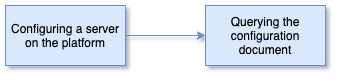

<!-- SPDX-License-Identifier: CC-BY-4.0 -->
<!-- Copyright Contributors to the ODPi Egeria project 2020. -->

# Configuring a metadata server on the OMAG Server Platform

The OMAG Server Platform is able to host one-to-many OMAG servers.
An OMAG Server is responsible for supporting the integration of different types of
technology.  There are different types of OMAG Servers in Egeria.
In this session you are going to learn how to set up particular type of OMAG server called a metadata server.

Watch the overview of this session: [https://youtu.be/c1g2vY_0mYs](https://youtu.be/c1g2vY_0mYs).

Begin by understanding about the different types of OMAG Servers and what they are used for by
following the link below:
* [Egeria's OMAG Servers](../../../open-metadata-implementation/admin-services/docs/concepts/omag-server.md)

In this first exercise you are going to use Postman to configure a simple metadata server called
`myMetadataServer`.

* In the Postman Egeria Environment, update the variable called `server` from `myServer` to `myMetadataServer`.

Using the `Egeria-admin-services-server-configuration` Postman collection and the instructions
from the [Admin services user guide on metadata servers](../../../open-metadata-implementation/admin-services/docs/concepts/metadata-server.md)
create the configuration for `myMetadataServer` as follows.  For each value, find the right REST API request in the
Postman collection.  Then look at where the values come from.  Sometimes you will need to change the variable
value in the Egeria Environment, sometimes you can type it directly into the request URL and other times,
the request in Postman is just what you need.

Each time you add a configuration value, 
[retrieve the server's configuration](../../../open-metadata-implementation/admin-services/docs/concepts/configuration-document.md)
to see how the effect of your requests are changing the server's configuration.

* **local server URL root** to `https://localhost:19443`

  This call is located in the Postman collection `Egeria-admin-services-server-configuration` in folder
  `Configuring OMAG Servers/Confguration for Cohort Members/Set local server URL root`.
  
  The specific documentation for this call is in the Admin Guide [here](../../../open-metadata-implementation/admin-services/docs/user/configuring-local-server-url.md).

* **localServerType** to `Egeria Dojo Metadata Server` (update the value in the request)

  This call is located in the Postman collection `Egeria-admin-services-server-configuration` in folder
  `Configuring OMAG Servers/Set local server type`.
  
  The specific documentation for this call is in the Admin Guide [here](../../../open-metadata-implementation/admin-services/docs/user/configuring-omag-server-basic-properties.md).

* **organizationName** to your organization name (update the variable `organization_name`).
 
  This call is located in the Postman collection `Egeria-admin-services-server-configuration` in folder
  `Configuring OMAG Servers/Set organization name`.
  
  The specific documentation for this call is in the Admin Guide [here](../../../open-metadata-implementation/admin-services/docs/user/configuring-omag-server-basic-properties.md).
 
* **localServerUserId** to `myMetadataServerUserId`.

  This call is located in the Postman collection `Egeria-admin-services-server-configuration` in folder
  `Configuring OMAG Servers/Set local server user Id`.
  
  The specific documentation for this call is in the Admin Guide [here](../../../open-metadata-implementation/admin-services/docs/user/configuring-omag-server-basic-properties.md).

* **localServerPassword** to `myMetadataServerPassword`

  This call is located in the Postman collection `Egeria-admin-services-server-configuration` in folder
  `Configuring OMAG Servers/Set local server user password`.
  
  The specific documentation for this call is in the Admin Guide [here](../../../open-metadata-implementation/admin-services/docs/user/configuring-omag-server-basic-properties.md).

* **maxPageSize** - the maximum page size that can be set on requests to the server. The default value is 1000.

  This call is located in the Postman collection `Egeria-admin-services-server-configuration` in folder
  `Configuring OMAG Servers/Set max page size`.
  
  The specific documentation for this call is in the Admin Guide [here](../../../open-metadata-implementation/admin-services/docs/user/configuring-omag-server-basic-properties.md).

* Add a graph-based local repository.  This will store metadata in JanusGraph.

  This call is located in the Postman collection `Egeria-admin-services-server-configuration` in folder
  `Configuring OMAG Servers/Configuration for Cohort Members/Configuration for Metadata Access Points/Configuration for Metadata Servers/Enable the graph repository`.
  
  The specific documentation for this call is in the Admin Guide [here](../../../open-metadata-implementation/admin-services/docs/user/configuring-the-local-repository.md).

* Configure the **Asset Owner** Open Metadata Access Service (OMAS). URL name for this service is `asset-owner`.

  This call is located in the Postman collection `Egeria-admin-services-server-configuration` in folder
  `Configuring OMAG Servers/Configuration for Cohort Members/Configuration for Metadata Access Points/Enable a specific access service`.
  
  The specific documentation for this call is in the Admin Guide [here](../../../open-metadata-implementation/admin-services/docs/user/configuring-the-access-services.md).

* Set up the Coco Pharmaceutical **Server** Security connector to provide authorization checks for inbound REST API calls.

  This call is located in the Postman collection `Egeria-admin-services-server-configuration` in folder
  `Configuring OMAG Servers/Set Server Security Connection`.
  
  The specific documentation for this call is in the Admin Guide [here](../../../open-metadata-implementation/admin-services/docs/user/configuring-the-server-security-connector.md).

Once the configuration is complete you are ready to move on to the next section.

## Test yourself

* What is the name of the place where a server's configuration is assembled?
* What determines where the server configuration is stored?
* What is the quickest way to discover what has recently changed in a server's configuration?

----

* Return to [Platform set up and configuration](egeria-dojo-day-1-3-1-platform-set-up-and-configuration.md)
* Return to [Dojo Overview](.)

----
License: [CC BY 4.0](https://creativecommons.org/licenses/by/4.0/),
Copyright Contributors to the ODPi Egeria project.
