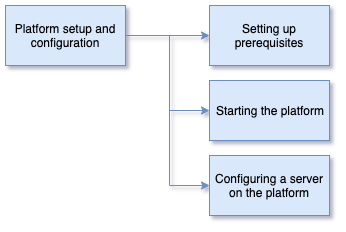

<!-- SPDX-License-Identifier: CC-BY-4.0 -->
<!-- Copyright Contributors to the ODPi Egeria project 2020. -->

# Platform set up and configuration

In this session, you will learn about the Open Metadata and Governance (OMAG) Server Platform that
hosts many of the services provided by Egeria.

There are three parts to this session.
Click on the links in turn to find out more:

* [Setting up prerequisites for running Egeria](egeria-dojo-day-1-3-1-1-platform-set-up-prerequisites.md)
* [Configuring the OMAG Server Platform](egeria-dojo-day-1-3-1-2-configuring-the-platform.md)
* [Configuring a server on the platform](egeria-dojo-day-1-3-1-3-configuring-a-server.md)

Once you have finished, take a break and then go on to the next section.

----
* Progress to [Running metadata servers](egeria-dojo-day-1-3-2-running-metadata-servers.md)

* Return to [Running Egeria on your machine - Step-by-Step](egeria-dojo-day-1-3-running-egeria.md)
* Return to [Dojo Overview](.)

----
License: [CC BY 4.0](https://creativecommons.org/licenses/by/4.0/),
Copyright Contributors to the ODPi Egeria project.