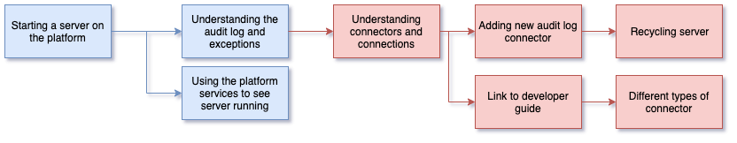

<!-- SPDX-License-Identifier: CC-BY-4.0 -->
<!-- Copyright Contributors to the ODPi Egeria project 2020. -->

# Starting a server on the OMAG Server Platform

In this session, you will learn how to start a server on the Open Metadata and Governance (OMAG) Server Platform.
There are also optional advanced exercises in this session.

Using Postman, and the `Egeria-admin-services-operational` Postman collection, start your server `myMetadataServer`.
The documentation from the Admin Guide is shown below.

* [Starting and Stopping OMAG Servers](../../../open-metadata-implementation/admin-services/docs/user/starting-and-stopping-omag-server.md)

From Docker Desktop, look at the logs for your docker container to see the audit log messages.
There are different type of audit log messages

* [Diagnostic Guide](../../../open-metadata-publication/website/diagnostic-guide)

# Optional material

* [Add the file audit log connector to your server configuration](../../../open-metadata-implementation/admin-services/docs/user/configuring-the-audit-log.md).
  Restart your server and then, from Docker Desktop, open the CLI and look at the log record files that have been created.
  
* The audit log destinations are configured using connections that define how to create an appropriate connector.
  Now link to the [Developer Guide](../../../open-metadata-publication/website/developer-guide)
  to understand more about connectors.

----
* Progress to [Calling the server API](egeria-dojo-day-1-3-2-2-calling-server-api.md)

* Return to [Running metadata servers](egeria-dojo-day-1-3-2-running-metadata-servers.md)
* Return to [Dojo Overview](.)

----
License: [CC BY 4.0](https://creativecommons.org/licenses/by/4.0/),
Copyright Contributors to the ODPi Egeria project.