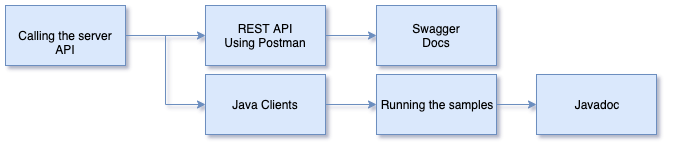

<!-- SPDX-License-Identifier: CC-BY-4.0 -->
<!-- Copyright Contributors to the ODPi Egeria project 2020. -->

# Calling the metadata server API

In this session, you will learn some of the API calls that are possible on the metadata server.

For this exercise, you will be using the following Postman collections:
* `Egeria-repository-services-local-repository`
* `Egeria-asset-owner-omas`

The aim is to show the differences between the fine-grained repository services APIs and the 
courser-grained, but more specialized access services APIs.

Start with the the Asset Owner OMAS interface and add a CSV file.  This returns a list of assets it has created,
one for the directory and one for the filename.  Retrieve these assets using the 

Now use the repository service API to see how these assets are stored.

What are the differences?

Later on today, you will have a change to work with the [Open Metadata Labs](../../open-metadata-labs)
that provide a lot more explanation on the APIs and their differences.
The purpose of this exercise was to giver you direct experience of the REST APIs.

----
* Progress to [Working with prepared content](egeria-dojo-day-1-3-2-3-working-with-archives.md)

* Return to [Running metadata servers](egeria-dojo-day-1-3-2-running-metadata-servers.md)
* Return to [Dojo Overview](.)

----
License: [CC BY 4.0](https://creativecommons.org/licenses/by/4.0/),
Copyright Contributors to the ODPi Egeria project.