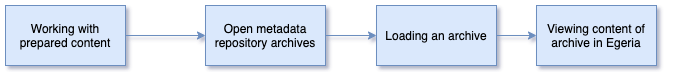

<!-- SPDX-License-Identifier: CC-BY-4.0 -->
<!-- Copyright Contributors to the ODPi Egeria project 2020. -->


# Working with prepared content

In this session, you will learn about open metadata archives and how they can be used to
load prepared content such as glossaries or standard models into a metadata server.



First read about [Open Metadata Archives](../..).

Egeria has a number of pre-built content packs in the `content-packs` directory on
GitHub - [Click to link to it](https://github.com/odpi/egeria/tree/master/content-packs)

Using Postman, try to create a new request that loads this archive.

The format of the REST API is:

```
POST {{baseURL}}/open-metadata/admin-services/users/{{user}}/servers/{{server}}/instance/open-metadata-archives/file
```
Where the filename is a TEXT request body.  This is the file name you need to specify
```
https://raw.githubusercontent.com/odpi/egeria/master/content-packs/CloudInformationModel.json`
```
When you execute the request, look at the logs in Docker Desktop to see any errors or to watch the
archive load.

The [Open Metadata Labs](../../open-metadata-labs) has a specific lab for working with this archive
and through that you will get a chance to query its content.

# Test yourself

* What is the message identifier of the Audit Log message produced when an element is loaded from an archive?

----
* Progress to [Creating a second server and connecting via a cohort](egeria-dojo-day-1-3-2-4-second-server.md)


* Return to [Running metadata servers](egeria-dojo-day-1-3-2-running-metadata-servers.md)
* Return to [Dojo Overview](.)

----
License: [CC BY 4.0](https://creativecommons.org/licenses/by/4.0/),
Copyright Contributors to the ODPi Egeria project.