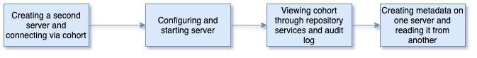

<!-- SPDX-License-Identifier: CC-BY-4.0 -->
<!-- Copyright Contributors to the ODPi Egeria project 2020. -->


# Creating a second server and connecting via a cohort

Metadata servers can exchange metadata via open metadata repository cohorts.
In this session you will learn how to connect two servers via a cohort.
But first you need to create a second server.



The docker image that you have been using is isolated in a container.  This is good as far as it goes
but is no help when you want to connect it to other servers.
For this next exercise, we are going to use `docker-compose` to run a set of docker containers with different
technologies.

Watch video showing docker compose and the open metadata labs: [https://youtu.be/nuRKPfRDKEc](https://youtu.be/nuRKPfRDKEc)

Before you move forward, shut down your egeria docker container using the docker desktop to save cycles on your machine.
You can delete it if you do not want it any more.

## Set up environment

Now [download the latest version of Egeria from GitHub](../building-egeria-tutorial/task-downloading-egeria-source.md)
in a new directory on your machine.  This is a direct copy of the latest content from GitHub.

1. From within the `egeria/open-metadata-resources/open-metadata-deployment/compose/tutorials` directory, run the command:

    ```bash
    $ docker-compose -f ./egeria-tutorial.yaml up
    ```

1. You may need to wait while some containers are downloaded . They will then be started, which will likely take less than a minute. Once you see the following lines:

    ```text
    core_1     | Thu Sep 26 19:33:54 GMT 2019 OMAG server platform ready for configuration
    datalake_1 | Thu Sep 26 19:33:55 GMT 2019 OMAG server platform ready for configuration
    dev_1      | Thu Sep 26 19:33:56 GMT 2019 OMAG server platform ready for configuration
    factory_1  | Thu Sep 26 19:33:57 GMT 2019 OMAG server platform ready for configuration

    ```

     or activity has subsided (as there are many log entries output), your self-contained environment should be ready.
     
Repeat the previous server configuration exercise twice - once to create a server called `server1` and again to create a server called `server 2`.

## Connect the Servers via a Cohort

Once you have 2 servers configured, add configuration to each of them to connect them via a cohort.

First read about [Open Metadata Repository Cohorts](../../../open-metadata-implementation/repository-services/docs/open-metadata-repository-cohort.md).

Then
* [Set up the event bus defaults](../../../open-metadata-implementation/admin-services/docs/user/configuring-event-bus.md)
* Connect then together by [adding cohort configuration](../../../open-metadata-implementation/admin-services/docs/user/configuring-registration-to-a-cohort.md) to each server.

Start both servers and view their logs via the Docker Desktop - you should see that they are communicating.

Now use the commands in the `Egeria-repository-services-metadata-highway` to query information about
the cohort from each server's perspective.

----

* Return to [Running metadata servers](egeria-dojo-day-1-3-2-running-metadata-servers.md)
* Return to [Dojo Overview](.)

----
License: [CC BY 4.0](https://creativecommons.org/licenses/by/4.0/),
Copyright Contributors to the ODPi Egeria project.