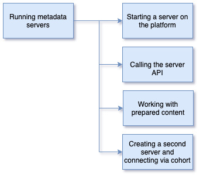

<!-- SPDX-License-Identifier: CC-BY-4.0 -->
<!-- Copyright Contributors to the ODPi Egeria project 2020. -->

# Running Metadata Servers

In this session, you will learn how to work with a metadata server on the OMAG Server Platform.

There are four parts to this section.  The links below take you to the content:
However, before embarking on the session, you can watch this video
showing docker compose and the open metadata labs: [https://youtu.be/nuRKPfRDKEc](https://youtu.be/nuRKPfRDKEc).
This will give you an overview of process.

Then follow along with the exercises below to try this out for yourself.

* [Starting a server](egeria-dojo-day-1-3-2-1-starting-the-server.md)
* [Calling the server API](egeria-dojo-day-1-3-2-2-calling-server-api.md)
* [Working with prepared content](egeria-dojo-day-1-3-2-3-working-with-archives.md)
* [Creating a second server and connecting via a cohort](egeria-dojo-day-1-3-2-4-second-server.md)

Take a break and then go onto the last section.
This introduces new types of servers that work with the metadata server.

----
* Progress to [Running metadata ecosystems](egeria-dojo-day-1-3-3-running-metadata-ecosystems.md)

* Return to [Running Egeria on your machine - Step-by-Step](egeria-dojo-day-1-3-running-egeria.md)
* Return to [Dojo Overview](.)

----
License: [CC BY 4.0](https://creativecommons.org/licenses/by/4.0/),
Copyright Contributors to the ODPi Egeria project.