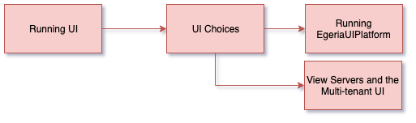

<!-- SPDX-License-Identifier: CC-BY-4.0 -->
<!-- Copyright Contributors to the ODPi Egeria project 2020. -->

# Running User Interfaces (UIs)

In this session, you will learn about the user interfaces provided by Egeria.

Egeria has two User Interfaces in development at the moment, each focused at different
types of organization.

The **EgeriaUIPlatform** provides a user interface for a mature organization that has already invested in a metadata
capability and is using Egeria to integrate tools into their metadata repository plus add advanced features.

The second UI makes use of view servers and a thin presentation server.  It is multi-tenant and is
focused on supporting all aspects of an organization's metadata integration and governance needs.

Since these capabilities are still in development, this session will be a demonstration of the two UIs we have.
At a later date, the dojo will be updated to include exercises where you can run them yourselves.

Watch the presentation and demo: [https://youtu.be/gVNbqKjwH94](https://youtu.be/gVNbqKjwH94)

----
* Progress to [Running governance servers](egeria-dojo-day-1-3-3-2-running-governance-servers.md)

* Return to [Running metadata ecosystems](egeria-dojo-day-1-3-3-running-metadata-ecosystems.md)
* Return to [Dojo Overview](.)

----
License: [CC BY 4.0](https://creativecommons.org/licenses/by/4.0/),
Copyright Contributors to the ODPi Egeria project.