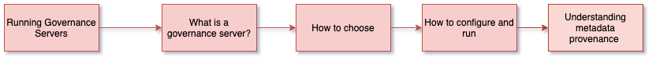

<!-- SPDX-License-Identifier: CC-BY-4.0 -->
<!-- Copyright Contributors to the ODPi Egeria project 2020. -->

# Running governance servers

In this session, you will learn about a new type of OMAG Server called the Governance Server.

The governance server makes active use of open metadata in third party technologies and the open metadata cohorts.

They are divided into two main groups:
* the governance servers that host a governance engine. 
The governance engine is performing some sort of governance operation such as metadata discovery or stewardship.
* the governance servers that exchange metadata between third party technologies and the open metadata ecosystem.

Click on the link below to dive into more detail:

* [Overview of the Governance Servers](../../../open-metadata-implementation/admin-services/docs/concepts/governance-server-types.md)

## Test yourself

* How many different types of integration patterns can an integration daemon support?
* Which type of governance server runs a **discovery engine**?
* What types of OMAG Servers does a governance server connect to and why?

## Next steps

Much of today's dojo has been about the infrastructure of Egeria so that you have enough knowledge to set up and
run the platform and then experiment with it to learn more.
 
The final session in the Dojo today is to use Kubernetes and the lab hands on environment
to run a mixture of OMAG Server types and experience the types of use cases that the Egeria
Technology supports.

----
* Progress to [Kubernetes and Lab Notebooks](egeria-dojo-day-1-3-3-3-kubernetes-and-labs.md)

* Return to [Running metadata ecosystems](egeria-dojo-day-1-3-3-running-metadata-ecosystems.md)
* Return to [Dojo Overview](.)

----
License: [CC BY 4.0](https://creativecommons.org/licenses/by/4.0/),
Copyright Contributors to the ODPi Egeria project.