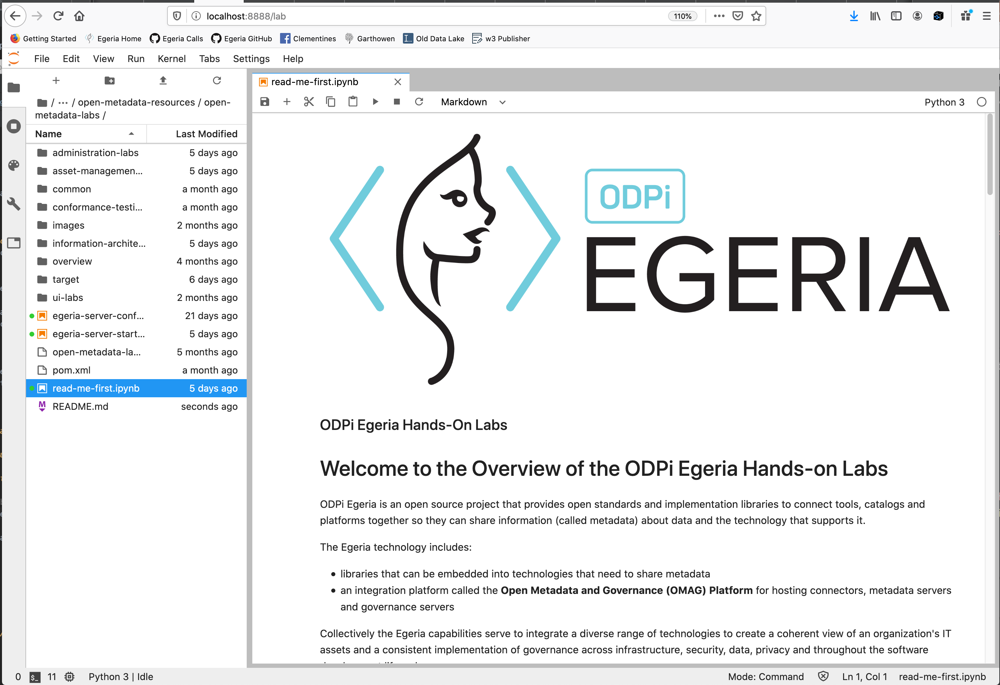

<!-- SPDX-License-Identifier: CC-BY-4.0 -->
<!-- Copyright Contributors to the ODPi Egeria project 2020. -->

# Kubernetes and lab notebooks

The final session in day one of the Egeria Dojo is to use our Kubernetes
helm charts to set up the infrastructure for Egeria's hands on labs.
These labs attempt to show a rich metadata environment in action,
allowing you to experiment with different concepts and APIs.

First, go to you Docker Desktop and shut down all of your docker containers that were started
by docker-compose (your laptop will thank you for that.)

Now go to the [Lab Infrastructure tutorial](../lab-infrastructure-guide)
and follow the instructions for setting up the lab environment using Kubernetes.

Once it is running, go to the [Open Metadata Labs](../../open-metadata-labs) instructions
to start the first lab notebook.

There is more material to run in the Open metadata Labs than can be done in 30 minutes.
The purpose of this session is to ensure that you can set up the environment
so you can run it at you leisure when every you want to.

In addition, these labs (like everything else in Egeria) is evolving rapidly so it is worth
checking back from time to time to see what is new.

----

* Return to [Running metadata ecosystems](egeria-dojo-day-1-3-3-running-metadata-ecosystems.md)
* Return to [Dojo Overview](.)

----
License: [CC BY 4.0](https://creativecommons.org/licenses/by/4.0/),
Copyright Contributors to the ODPi Egeria project.