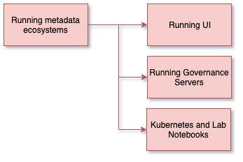

<!-- SPDX-License-Identifier: CC-BY-4.0 -->
<!-- Copyright Contributors to the ODPi Egeria project 2020. -->

# Running metadata ecosystems

Metadata servers store and maintain metadata.  In this next session, you will learn how to
actively capture metadata and make use of it to manage your data and IT landscape.

Click on the links to get to the session content:

* [Running the User Interface (UI)](egeria-dojo-day-1-3-3-1-running-ui.md)
* [Running Governance Servers](egeria-dojo-day-1-3-3-2-running-governance-servers.md)
* [Kubernetes and lab notebooks](egeria-dojo-day-1-3-3-3-kubernetes-and-labs.md)

----

* Return to [Running Egeria on your machine - Step-by-Step](egeria-dojo-day-1-3-running-egeria.md)
* Return to [Dojo Overview](.)

----
License: [CC BY 4.0](https://creativecommons.org/licenses/by/4.0/),
Copyright Contributors to the ODPi Egeria project.