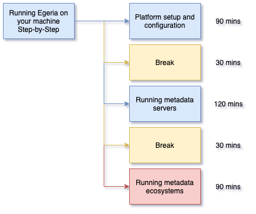

<!-- SPDX-License-Identifier: CC-BY-4.0 -->
<!-- Copyright Contributors to the ODPi Egeria project 2020. -->

# Running Egeria on your machine - Step-by-Step

In this session, you will be guided on how to set up Egeria on your machine
to perform a variety of use cases.

There are four main ways to run Egeria on your machine:
* Download the Egeria repository from GitHub, build it and run the resulting image.
* Download the Egeria docker image and run it as a standalone container using docker desktop.
* Download the Egeria repository and use the docker-compose scripts to run egeria with a supporting cast of other
  technologies.
* Download the Egeria repository and use the kubernetes helm charts to run egeria with a supporting cast of other
  technologies.
  
This is in addition to the different ways that developers run Egeria when they are testing their contributions.

Each of these methods has different benefits and costs. During the next two days you will have the opportunity to
try each of these approaches so you can understand their pros and cons to make the best choice for your organization.

Click on the links below in turn to access each part of this session.
Don't forget to take your breaks.  There is a lot of content to get through.

* [Platform set up and configuration](egeria-dojo-day-1-3-1-platform-set-up-and-configuration.md)
* [Running metadata servers](egeria-dojo-day-1-3-2-running-metadata-servers.md)
* [Running metadata ecosystems](egeria-dojo-day-1-3-3-running-metadata-ecosystems.md)

Congratulations, you have completed the final step in the largest session in the dojo.
There is one more short section to go and you have completed Day 1.

----
* Progress to [Participating in the community](egeria-dojo-day-1-4-participating-in-the-community.md)

* Return to [Egeria Project Introduction](egeria-dojo-day-1-2-project-introduction.md)
* Return to [Dojo Overview](.)

----
License: [CC BY 4.0](https://creativecommons.org/licenses/by/4.0/),
Copyright Contributors to the ODPi Egeria project.