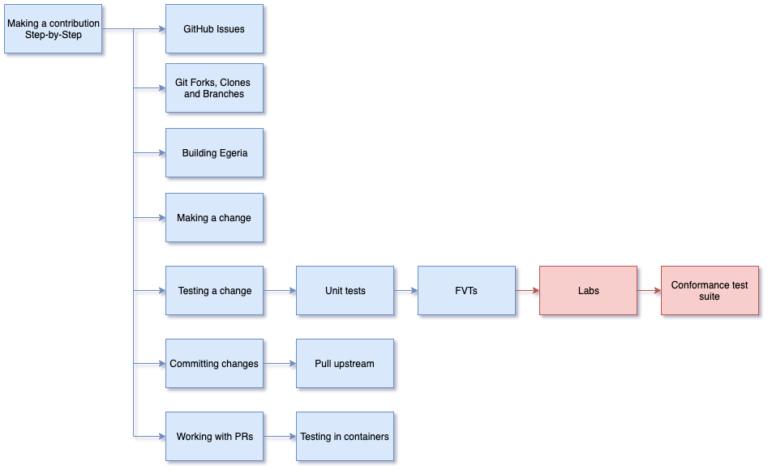

<!-- SPDX-License-Identifier: CC-BY-4.0 -->
<!-- Copyright Contributors to the ODPi Egeria project 2020. -->

# Making a contribution to Egeria - Step-by-Step

In this session, you will be guided on how to make a simple change to the Egeria project.
This change is to add a new file to the
[egeria-dojo-postcards directory](https://github.com/odpi/egeria/tree/master/open-metadata-resources/open-metadata-tutorials/egeria-dojo-postcards)
and link to it in the `README.md` file of the same directory.

There are two videos for this session:

* How to make a contribution: [https://youtu.be/vdHRtuIYwoE](https://youtu.be/vdHRtuIYwoE)
* Pull Requests and testing: [https://youtu.be/pMODYyPJ1b4](https://youtu.be/pMODYyPJ1b4)
## The Steps

To create your own contribution, click on each step and complete the tasks described:

* [Review the developer guidelines](../../../developer-resources/Developer-Guidelines.md) to understand the requirements
  for an Egeria contribution.

* [Log on to GitHub](../git-and-git-hub-tutorial/task-getting-git-hub-id.md).

* [Create a Git Issue](../git-and-git-hub-tutorial/task-creating-an-issue-on-git-hub.md). 
  Every contribution begins with a `git issue`. This describes the changes that you plan to make.
  The more detail that you provide, the better the maintainers will understand your contribution and
  be able to process it faster.
  
* [Create a fork and clone of the git repository](../git-and-git-hub-tutorial/task-creating-a-fork-and-clone.md)
  to bring the Egeria code onto your machine.

* [Create a new git branch](../git-and-git-hub-tutorial/task-adding-changes-to-git.md) to contain your change.

* [Load Egeria into your IDE](../intellij-tutorial/task-loading-egeria-into-intellij.md) so that you can see the project contents.

* [Build Egeria](../intellij-tutorial/task-building-egeria-in-intellij.md) so it is ready to run.
  The link assumes you are using IntelliJ.  If you prefer working with the command line try [this link](../building-egeria-tutorial/task-building-egeria-source.md)

* [Create your contribution](../intellij-tutorial/task-creating-content-with-intellij.md) - typically using the IDE.
  You need to create a new markdown file, add your message to the file and then add a link to the README.md file.
  Both of these files should use [Markdown](../../../developer-resources/tools/Markdown.md) and
  include license and copyright statements top and bottom of the file just like this file: 
  [License File Example](https://raw.githubusercontent.com/odpi/egeria/master/developer-resources/License-Example-Files/License_for_Markdown_Files.md).
  
  (There is more information on licences in the [Developer Guidelines](../../../developer-resources/Developer-Guidelines.md).)

* [Test your changes](../testing-egeria-tutorial) to make sure your new function works and nothing else has broken.
  Since this is a document change, there should be no impact on the code - so running these tests is to check that
  nothing has changed by accident.

* [Add and commit changes to Git](../git-and-git-hub-tutorial/task-adding-changes-to-git.md).
  As you commit your changes, make sure they are signed (see [Why the DCO?](../../../developer-resources/why-the-dco.md)).

* Initiate the [request to include your changes](../git-and-git-hub-tutorial/task-git-pull-push-pr.md) into the master branch of Egeria.
  
Once the PR is in place, GitHub will check the DCOs for you commits, and then run a full build on Java 8 and Java 11.
The Egeria maintainers will review your contribution and may ask
ask you to make changes to it.  When it is acceptable, they will merge it into master
and your contribution is complete.

----
* Progress to [Types of Contribution](egeria-dojo-day-2-4-types-of-contribution.md)

* Return to [Tools for Contributors](egeria-dojo-day-2-2-tools-for-contributors.md)
* Return to [Dojo Overview](.)

----
License: [CC BY 4.0](https://creativecommons.org/licenses/by/4.0/),
Copyright Contributors to the ODPi Egeria project.