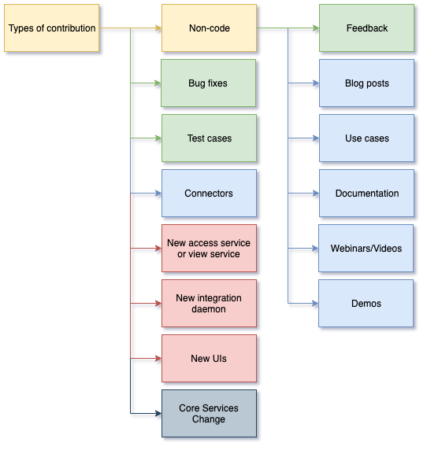

<!-- SPDX-License-Identifier: CC-BY-4.0 -->
<!-- Copyright Contributors to the ODPi Egeria project 2020. -->

# Types of contribution

In this session, you will learn about the different types of contribution and how much knowledge of
Egeria is required to complete one.

The diagram below shows the different types of contribution.  We have used the
same color scheme as the dojo sessions to give you a view on how hard each one is.

The video describe each type of contribution with pointers to the design information you need
to make a contribution of that type.

* [https://youtu.be/_nnoQGk84bk](https://youtu.be/_nnoQGk84bk)

----
* Progress to [Becoming a contributor](egeria-dojo-day-2-5-becoming-a-contributor.md)

* Return to [Contributing to Egeria - Step-by-Step](egeria-dojo-day-2-3-contribution-to-egeria.md)
* Return to [Dojo Overview](.)

----
License: [CC BY 4.0](https://creativecommons.org/licenses/by/4.0/),
Copyright Contributors to the ODPi Egeria project.