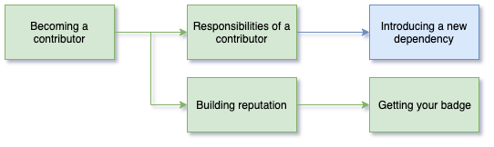

<!-- SPDX-License-Identifier: CC-BY-4.0 -->
<!-- Copyright Contributors to the ODPi Egeria project 2020. -->

# Becoming an Egeria contributor

In this session, you will learn about how to be recognized as an Egeria Contributor by the Egeria community.

Watch the video to find out more: [https://youtu.be/e3pEXZ6iatE](https://youtu.be/e3pEXZ6iatE)

## What does it mean to be recognized as an Egeria contributor?

An **Egeria Contributor** is someone who has made multiple quality contributions to the Egeria community.
This role is described in the [Operations Guide](../../../Egeria-Operations.md).

## Egeria badges

To recognise individuals who are established contributors to the Egeria project,
the Egeria community is able to award [Acclaim badges](../../../developer-resources/badges).

## Test yourself

Using the material from the Egeria operations guide
answer the following questions.

* How many contributors are listed for the Egeria project?
* What is the DCO?
* How often do the maintainers create a release of Egeria?

## End of Day 2

Congratulations you have completed all of the sessions in
Day 2 of the Egeria Dojo.

Day 3 covers additional information for advocates
and those wishing to become **Egeria Maintainers**.

----
* Progress to [Dojo Overview](.) to see the content for day 3.

* Return to [Running Egeria on your machine Step-by-Step](egeria-dojo-day-1-3-running-egeria.md)

----
License: [CC BY 4.0](https://creativecommons.org/licenses/by/4.0/),
Copyright Contributors to the ODPi Egeria project.