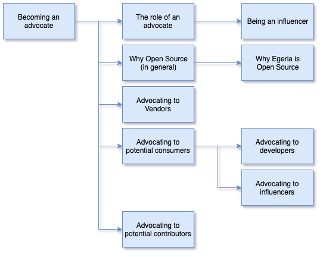

<!-- SPDX-License-Identifier: CC-BY-4.0 -->
<!-- Copyright Contributors to the ODPi Egeria project 2020. -->

# Becoming an advocate

In this session, you will learn about how to become an advocate for the Egeria technology.

Watch the video to hear about being an Egeria advocates from the experts:

* [https://youtu.be/zmr7H6Tk5BM](https://youtu.be/zmr7H6Tk5BM)

----
* Progress to [Becoming a maintainer](egeria-dojo-day-3-2-becoming-a-maintainer.md)

* Return to [Dojo Overview](.)

----
License: [CC BY 4.0](https://creativecommons.org/licenses/by/4.0/),
Copyright Contributors to the ODPi Egeria project.