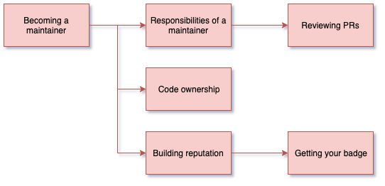

<!-- SPDX-License-Identifier: CC-BY-4.0 -->
<!-- Copyright Contributors to the ODPi Egeria project 2020. -->

# Becoming a maintainer

In this session, you will learn useful tips on building a reputation that will help you
to be recognized as an Egeria Maintainer.

Listen to Egeria's maintainers talking about their experiences on being a maintainer
on Egeria.

* [https://youtu.be/BQf48I6pFf8](https://youtu.be/BQf48I6pFf8)

## Further information

Requirements for being a maintainer is described in Egeria's
[Operation Guide](../../../Egeria-Operations.md).

**Note**: a maintainer on Egeria is equivalent to a "committer" in the 
[Apache Software Foundation (ASF)](http://apache.org/foundation/how-it-works.html).

----
* Progress to [Egeria Architecture and Philosophy - the deep stuff](egeria-dojo-day-3-3-egeria-architecture.md)

* Return to [Becoming an advocate](egeria-dojo-day-3-1-becoming-an-advocate.md)
* Return to [Dojo Overview](.)

----
License: [CC BY 4.0](https://creativecommons.org/licenses/by/4.0/),
Copyright Contributors to the ODPi Egeria project.