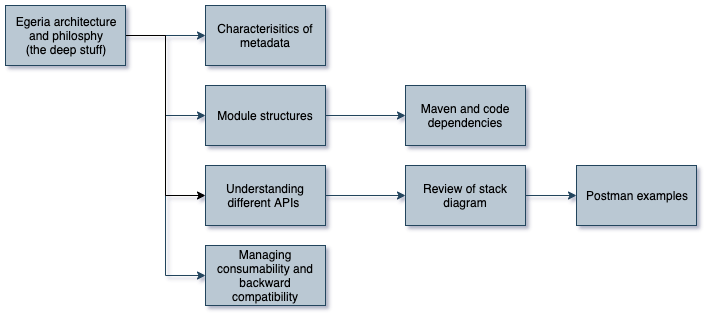

<!-- SPDX-License-Identifier: CC-BY-4.0 -->
<!-- Copyright Contributors to the ODPi Egeria project 2020. -->

# Egeria architecture and philosophy - the deep stuff

In this session, you will learn about the Egeria architecture, history and approach.

Watch this video to understand Egeria's architecture principles and
how they manifest themselves in the project's design and implementation.

* [https://youtu.be/n-Xm8_WIyBM](https://youtu.be/n-Xm8_WIyBM)

The charts for this session are stored in the
[data-governance git repository](https://github.com/odpi/data-governance/blob/master/workshops/may-2020/egeria-dojo-day-3-3-egeria-architecture.pptx).

----
* Progress to the [Egeria Social](egeria-dojo-day-3-4-egeria-social.md)

* Return to [Becoming a maintainer](egeria-dojo-day-3-2-becoming-a-maintainer.md)
* Return to [Dojo Overview](.)

----
License: [CC BY 4.0](https://creativecommons.org/licenses/by/4.0/),
Copyright Contributors to the ODPi Egeria project.