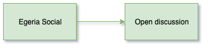

<!-- SPDX-License-Identifier: CC-BY-4.0 -->
<!-- Copyright Contributors to the ODPi Egeria project 2020. -->

# Egeria Social

Congratulations you have made it through the dojo.  If you are attending a live version of the Dojo,
this is the time to join the other participants and other members of the Egeria community in an
informal and open discussion.  Perhaps this is a time to start the conversation on what you would
like to contribute to the project?

Even if you are doing the dojo as a self-study exercise, now is a time to reflect on your next steps.

Here are some suggestions:
* If there are errors in the dojo - or missing explanations - then please consider contributing some improvements.
* Block time in your calendar for the community calls.
* Arrange to give a presentation to your colleagues on how Egeria could benefit your organization.
* Raise an issue on GitHub and get working on your next contribution.

If you would like to contribute, but are not sure what would be valuable, ask for advice on the
`#egeria-project` slack channel.

We look forward to working with you in the future.

----
* Return to [Dojo Overview](.)

----
License: [CC BY 4.0](https://creativecommons.org/licenses/by/4.0/),
Copyright Contributors to the ODPi Egeria project.