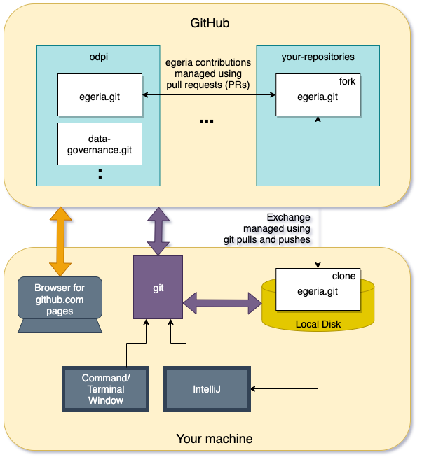

<!-- SPDX-License-Identifier: CC-BY-4.0 -->
<!-- Copyright Contributors to the ODPi Egeria project 2020. -->

# Git and GitHub Tutorial

This tutorial covers common tasks associated with using Git and GitHub to
work with the Egeria content and make a contribution.

For an overview of Git and GitHub see 
[developer-resources/tools](../../../developer-resources/tools/Git-GitHub.md).

## General Tasks

* [Getting a GitHub user log in](task-getting-git-hub-id.md) - This is required to add anything - even a comment
  to the Egeria project.
* [Creating an Issue on GitHub](task-creating-an-issue-on-git-hub.md) - Issues are used by developers to describe
  a contribution.  They are also used by consumers of Egeria to request help with function they think is not working.
* [Downloading Egeria to build and run](../building-egeria-tutorial/task-downloading-egeria-source.md) - If
  you do not want to make changes to Egeria, but want to build the distribution file to run it natively
  on your machine.  Then follow this task.  If you want to be able to make changes to Egeria and contribute
  them back to the community, then follow the developer tasks.

## Developer Tasks

The tasks below describe how to use Git and GitHub to create a contribution to the Egeria project.
The development process using Git and GitHub is illustrated in Figure 1.

> **Figure 1:** Git and GitHub development flow

The tasks below step through this process

* [Installing Git on your local Machine](task-installing-git.md)
* [Creating a Fork and a Clone](task-creating-a-fork-and-clone.md)
* [Creating a Branch in a git repository](task-creating-git-branches.md)
* [Adding your changes to a git repository](task-adding-changes-to-git.md)
* [Adding your contribution to Egeria](task-git-pull-push-pr.md)

In addition, these are [further tips](further-git-tips.md) for using Git.

----
* Return to [Egeria Dojo](../egeria-dojo/egeria-dojo-day-2-3-contribution-to-egeria.md)

----
License: [CC BY 4.0](https://creativecommons.org/licenses/by/4.0/),
Copyright Contributors to the ODPi Egeria project.