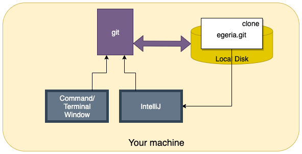

<!-- SPDX-License-Identifier: CC-BY-4.0 -->
<!-- Copyright Contributors to the ODPi Egeria project 2020. -->

# Adding your changes to you git clone

Once you have completed your contribution, you are ready to add it to your git clone.

Most development work is done on your local clone with occasional calls to GitHub to
synchronize with its versions of the repository.


> **Figure 1:** Local development process using git

Issue the `git status` command in a Terminal/Command window to verify all of your changes are
included.  This will list any new files and files that have been changed, but not yet included
in the git clone.  Use `git add` to add all of the files you want included.

For example:

```bash
$ git status

On branch example-branch
Untracked files:
  (use "git add <file>..." to include in what will be committed)

	new-file.java

$ git add new-file.java
$ git status

On branch example-branch
Changes to be committed:
  (use "git reset HEAD <file>..." to unstage)

	new file:   new-file.java
```

Now you are ready to [complete your contribution](task-git-pull-push-pr.md).

----
* Return to [Git and GitHub Tutorial](.)
* Return to [Egeria Dojo - Making a contribution step by step](../egeria-dojo/egeria-dojo-day-2-3-contribution-to-egeria.md)


* Link to Git/GitHub overview in [developer-resources/tools](../../../developer-resources/tools/Git-GitHub.md)

----
License: [CC BY 4.0](https://creativecommons.org/licenses/by/4.0/),
Copyright Contributors to the ODPi Egeria project.