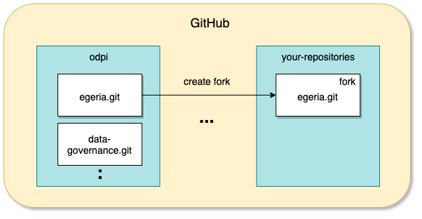
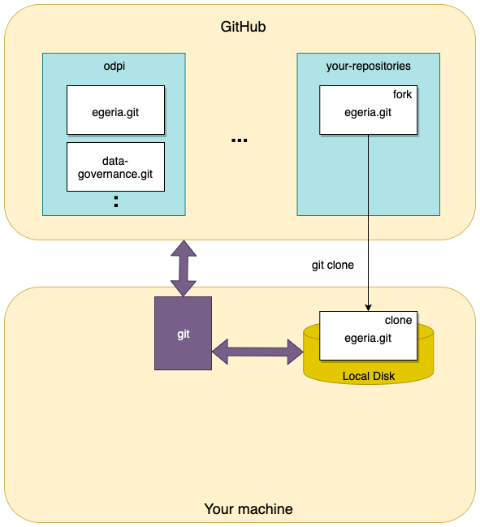

<!-- SPDX-License-Identifier: CC-BY-4.0 -->
<!-- Copyright Contributors to the ODPi Egeria project 2020. -->

# Creating a fork and a clone

The git repositories for Egeria are read only to everyone except the
[Egeria Maintainers](../../../MAINTAINERS.md).  This is to protect the content from
accidental or malicious damage.

However, anyone wanting to make a contribution needs
editing access to the repositories to make the change and test it.
This is achieved with the `git fork` and `git clone`.

## Forking

Forking creates your own version of the egeria git repository that is linked back to the
original.

Figure 1 illustrates the forking process.


> **Figure 1:** Forking an Egeria git repository

To create your fork, from your browser, navigate to the [Egeria GitHub URL](https://github.com/odpi/egeria),
and logging into the github UI with a 
[your GitHub id](task-getting-git-hub-id.md).
You will then see a 'Fork' button at the top right, and should click this to 
create your own fork to work with Egeria. 


This only needs to be done once.

## Cloning

Once you have your fork, you need to create a copy of the repository on your local machine.
This copy is called a **clone**.  You create a clone each time you are starting a significant piece of work.

Figure 2 illustrates the cloning process.


> **Figure 2:** Cloning an Egeria git repository

To create a clone on your machine enter the following in a new directory from a terminal/command window.
Replace `USER` with your GitHub userId.

```bash
$ git clone https://github.com/USER/egeria.git
$ cd egeria
```

The git clone command creates a new directory called `egeria` containing the Egeria content.

You should also set the upstream repository to connect your clone to the main Egeria repository:

```bash
$ git remote add upstream https://github.com/odpi/egeria.git
```

Now you are ready to [create a branch for your changes](task-creating-git-branches.md).

----
* Return to [Git and GitHub Tutorial](.)
* Return to [Egeria Dojo - Making a contribution step by step](../egeria-dojo/egeria-dojo-day-2-3-contribution-to-egeria.md)


* Link to Git/GitHub overview in [developer-resources/tools](../../../developer-resources/tools/Git-GitHub.md)
* Further details of [GitHub's fork and pull model](https://help.github.com/articles/about-collaborative-development-models/),
* Further details on the [fork](https://guides.github.com/activities/forking/) command.


----
License: [CC BY 4.0](https://creativecommons.org/licenses/by/4.0/),
Copyright Contributors to the ODPi Egeria project.