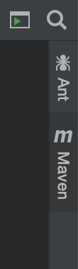
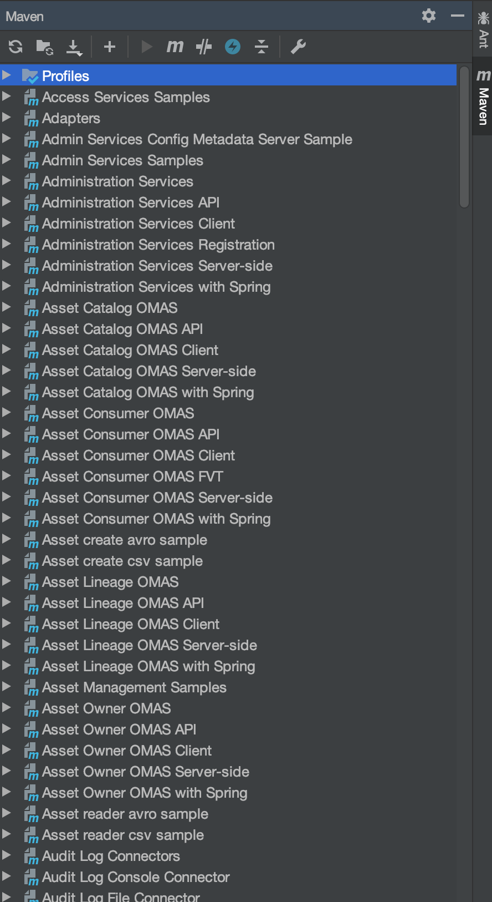
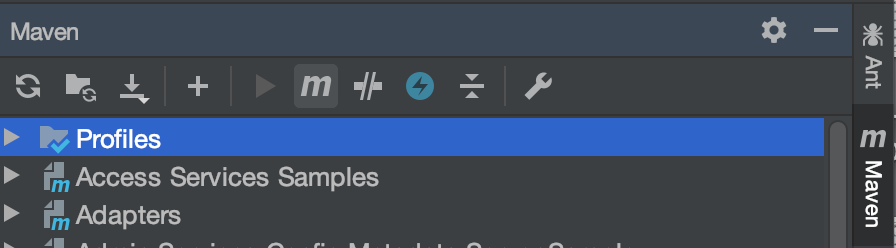

<!-- SPDX-License-Identifier: CC-BY-4.0 -->
<!-- Copyright Contributors to the ODPi Egeria project 2020. -->

# Building Egeria in IntelliJ IDEA

Maven is accessed from a sidebar menu in IntelliJ.

When you click on the **Maven** label, a panel opens with
the list of modules in
Egeria is displayed.

To build the whole project, select the **M** button at the top of the
maven panel.

Then a dialog box opens.  Enter `mvn clean install`.

Then the build kicks off.

The full build can take about 15 minutes.  It is worth doing a full build before
committing a change.  However it is also possible to build a single module.

Goto the maven sidebar panel and find the module you are interested in.
Open up the content for the module and then the lifecycle folder.

Double-click on install and the build of that module starts.

## Using maven rather than using the IntelliJ build?

While you are working on code in IntelliJ, it will be continuously rebuilding
your code so that it is discovering syntax other coding errors as you type.
This is useful in getting a first pass of your code.

However, IntelliJ does not understand the egeria structure - only Maven
does, so the Maven build is important to to verify your changes are
OK at the project level.

----
* Return to [Dojo Day 2](../egeria-dojo/egeria-dojo-day-2-3-contribution-to-egeria.md)
* Return to [Developer Tools](../../../developer-resources/tools/IntelliJ.md)
* Return to [IntelliJ tutorial](.)

----
License: [CC BY 4.0](https://creativecommons.org/licenses/by/4.0/),
Copyright Contributors to the ODPi Egeria project.