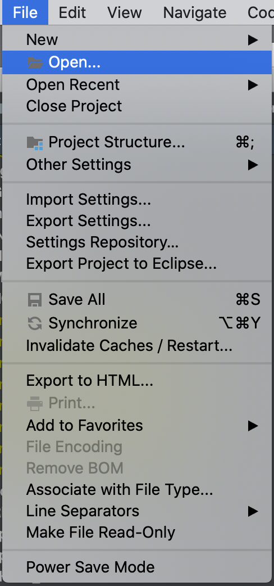
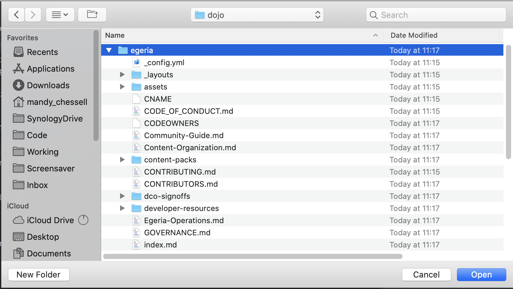

<!-- SPDX-License-Identifier: CC-BY-4.0 -->
<!-- Copyright Contributors to the ODPi Egeria project 2020. -->

# Loading Egeria into IntelliJ IDEA

Once you have [a branch of your git repository](../git-and-git-hub-tutorial/task-creating-git-branches.md)
you can load egeria into IntelliJ.

Go to the **File** menu and select **Open**

Then select the top-level directory that was created when you cloned the
git repository.

IntelliJ will then start reading the git repository and creating a project.
This may take a few minutes so be patient.

----
* Return to [Dojo Day 2](../egeria-dojo/egeria-dojo-day-2-3-contribution-to-egeria.md)
* Return to [Developer Tools](../../../developer-resources/tools/IntelliJ.md)
* Return to [IntelliJ tutorial](.)
 
----
License: [CC BY 4.0](https://creativecommons.org/licenses/by/4.0/),
Copyright Contributors to the ODPi Egeria project.