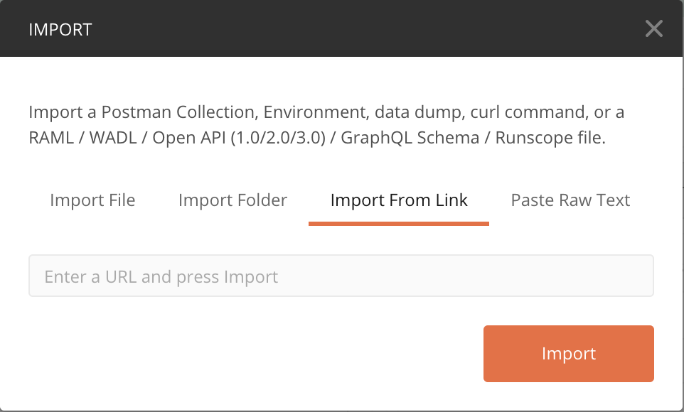
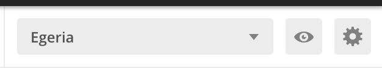
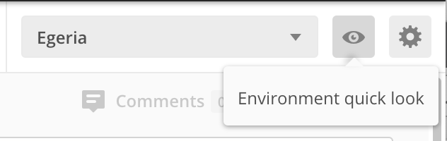

<!-- SPDX-License-Identifier: CC-BY-4.0 -->
<!-- Copyright Contributors to the ODPi Egeria project 2020. -->

# Postman

Postman provides an interactive application for issuing
REST API calls to a server.

If Postman is new to you, and you do not have it installed,
link to the Postman page in the 
[developer tools](../../../developer-resources/tools/Postman.md) for
installation instructions.

Once Postman is installed, start up the application.

You should see a user interface something like this:

The beauty of Postman is that it supports collections of
environments and requests.  This means we can pre-can
descriptions and implementations of different
requests to Egeria that can be widely shared.

## Importing the Egeria Environment

A Postman environment provides a set of common variable
that can be used in request definitions to make them
adaptable to different deployment environments.

The Egeria Environment is located on GitHub at this location:

* [https://raw.githubusercontent.com/odpi/egeria/master/open-metadata-resources/open-metadata-samples/postman-rest-samples/Egeria.postman_environment.json](https://raw.githubusercontent.com/odpi/egeria/master/open-metadata-resources/open-metadata-samples/postman-rest-samples/Egeria.postman_environment.json)

Copy the link and then click on Postman's Import menu option
(top left):

.

Select `Import from Link` and paste the URL of the environment
file in the URL box.

Check that the Egeria environment is selected in the
top left dropdown:

If you click on the "eye" shaped icon, you can see the
current values.

Make sure you have an OMAG Server Platform running
and set the values for your platform in the `CURRENT VALUE` column.

For example, if you are running the OMAG Server Platform
in either a docker container or kubernetes,
the `baseURL` variable will probably need to be changed to
`https://localhost:18080`.

These values can be changed at any time when you are using
Postman so you can direct requests to different servers and
switch users issuing the requests.

## Importing the Egeria Request Collections

The Egeria community are continually building new
Postman request collections as new APIs are added
to the platform.

The most popular collections are for the 
platform and administration services.  We will also use the collections from the repository services and asset owner
OMAS.

These collections are located in GitHub at the following
locations:

* [https://raw.githubusercontent.com/odpi/egeria/master/open-metadata-implementation/platform-services/Egeria-platform-services.postman_collection.json](https://raw.githubusercontent.com/odpi/egeria/master/open-metadata-implementation/platform-services/Egeria-platform-services.postman_collection.json)
* [https://raw.githubusercontent.com/odpi/egeria/master/open-metadata-implementation/admin-services/Egeria-admin-services-platform-configuration.postman_collection.json](https://raw.githubusercontent.com/odpi/egeria/master/open-metadata-implementation/admin-services/Egeria-admin-services-platform-configuration.postman_collection.json)
* [https://raw.githubusercontent.com/odpi/egeria/master/open-metadata-implementation/admin-services/Egeria-admin-services-server-configuration.postman_collection.json](https://raw.githubusercontent.com/odpi/egeria/master/open-metadata-implementation/admin-services/Egeria-admin-services-server-configuration.postman_collection.json)
* [https://raw.githubusercontent.com/odpi/egeria/master/open-metadata-implementation/admin-services/Egeria-admin-services-operational.postman_collection.json](https://raw.githubusercontent.com/odpi/egeria/master/open-metadata-implementation/admin-services/Egeria-admin-services-operational.postman_collection.json)
* [https://raw.githubusercontent.com/odpi/egeria/master/open-metadata-implementation/repository-services/Egeria-repository-services-audit-log.postman_collection.json](https://raw.githubusercontent.com/odpi/egeria/master/open-metadata-implementation/repository-services/Egeria-repository-services-audit-log.postman_collection.json)
* [https://raw.githubusercontent.com/odpi/egeria/master/open-metadata-implementation/repository-services/Egeria-repository-services-local-repository.postman_collection.json](https://raw.githubusercontent.com/odpi/egeria/master/open-metadata-implementation/repository-services/Egeria-repository-services-local-repository.postman_collection.json)
* [https://raw.githubusercontent.com/odpi/egeria/master/open-metadata-implementation/repository-services/Egeria-repository-services-metadata-highway.postman_collection.json](https://raw.githubusercontent.com/odpi/egeria/master/open-metadata-implementation/repository-services/Egeria-repository-services-metadata-highway.postman_collection.json)
* [https://raw.githubusercontent.com/odpi/egeria/master/open-metadata-implementation/access-services/asset-owner/Egeria-asset-owner-omas.postman_collection.json](https://raw.githubusercontent.com/odpi/egeria/master/open-metadata-implementation/access-services/asset-owner/Egeria-asset-owner-omas.postman_collection.json)

Using the import option again, load each of these collections
in turn.  You will see them populate the left-hand menu.

## Next steps

With the collections loaded, you are ready to
[return to the Egeria Dojo](../egeria-dojo/egeria-dojo-day-1-3-1-1-platform-set-up-prerequisites.md) to learn more about the
OMAG Server Platform.

Alternatively you can use the collections to test
existing function, or modify them to
test new function.

Instructions for contributing new Postman collections
are located in the [developer-resources](../../../developer-resources/Postman-Samples.md).

----
* Return to [other tutorials](..)
* Return to [Day 1 of the Egeria Dojo](../egeria-dojo/egeria-dojo-day-1-3-1-1-platform-set-up-prerequisites.md)

----
License: [CC BY 4.0](https://creativecommons.org/licenses/by/4.0/),
Copyright Contributors to the ODPi Egeria project.
